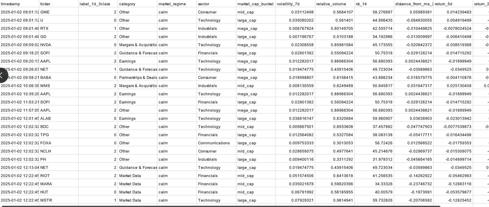
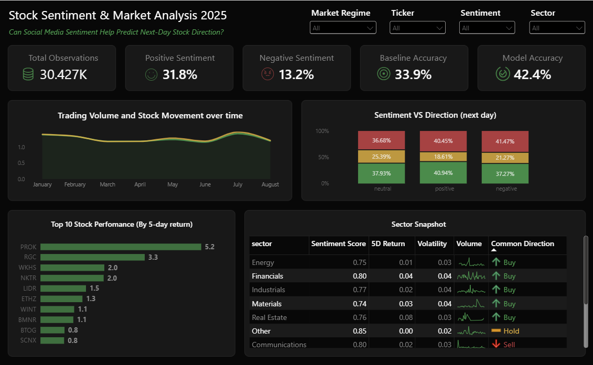

# Stock Sentiment & Market Analysis 2025

## Project Background

Stock prices are influenced by many factors, including market conditions, company performance, investor behavior, and public sentiment. With the growth of social media, investors increasingly express opinions and expectations about companies through online discussions.

This project investigates whether social-media sentiment contains useful information about short-term stock market movements. The analysis combines sentiment data with market and technical indicators to examine the relationship between investor sentiment and next-day stock direction.

The project focuses on four key dimensions:

1. **Market Behavior**

    Examines stock returns, trading volume, volatility, and technical indicators to understand how stocks behave over time.

2. **Social-Media Sentiment**

    Analyzes whether positive, neutral, or negative sentiment is associated with different next-day trading signals.

3. **Statistical Relationship**

    Uses statistical analysis to determine whether the observed relationship between sentiment and stock direction is meaningful rather than simply occurring by       chance.

4. **Predictive Value**

    Tests whether adding sentiment-related information can improve the ability to predict next-day stock direction compared with market and technical indicators.

The overall goal is not to assume that sentiment can predict stock prices, but to determine whether social-media sentiment provides additional information that could support short-term market analysis and decision-making.

**My power BI dashboard** [link to dashboard](https://drive.google.com/file/d/14Um2-KoQ6LaBObQziMnm3Uksvs3FDcxX/view?usp=sharing)
**Dataset** [link to dataset](https://drive.google.com/drive/folders/1zv4QHl4479dFcIVokQJ4TytcVYiHHozj?usp=drive_link)

## Dataset & Data Preparation

We are using three datasets:

- Training dataset
- Validation dataset
- Test dataset

The dataset contains financial social-media posts together with stock-market information and a next-day three-class target.

### Important Columns

- `timestamp` — date and time of the observation
- `ticker` — stock associated with the social-media post
- `text` — financial social-media post
- `label_1d_3class` — next-day stock direction
- `volatility_7d` — stock-price volatility over the previous 7 days
- `relative_volume` — current trading volume compared with normal volume
- `rsi_14` — 14-period Relative Strength Index
- `distance_from_ma_20` — distance between the stock price and its 20-day moving average
- `return_5d` — stock return over the previous 5 days
- `return_20d` — stock return over the previous 20 days
- `above_ma_20` — indicates whether the stock price is above its 20-day moving average
- `slope_ma_20` — direction of the 20-day moving average
- `gap_open` — difference between the previous closing price and the opening price
- `intraday_range` — price range during the trading session

### Target Variable

The target variable contains three next-day stock-direction classes:

- `0` = BUY
- `1` = HOLD
- `2` = SELL

### Quality Control & Preprocessing

- Inspected the dataset structure
- Checked missing values
- Explored repeated tweet URLs
- Created financial sentiment using FinBERT
- Added sentiment category
- Added sentiment probabilities
- Created sentiment strength using positive and negative probabilities
- Prepared market and technical indicators for predictive modeling

## Executive Summary

This project investigates whether financial social-media sentiment provides useful information for predicting next-day stock direction.

The analysis combines financial social-media sentiment with market and technical indicators and evaluates their relationship with three possible next-day directions: BUY, HOLD, and SELL.

Statistical analysis found a significant relationship between sentiment and next-day stock direction. However, the strength of this relationship was very weak.

Predictive modeling showed that market and technical indicators performed better than sentiment alone. Adding sentiment to the market and technical indicators did not improve predictive performance.

The results suggest that social-media sentiment contains some information about next-day stock direction, but the information was not strong enough to improve predictions beyond the market and technical indicators tested in this project.

---

## Predictive Modeling

This stage answers the practical question:

> Does sentiment actually help us predict stock direction?

Several models were tested.

### 1. Sentiment Only

Uses only financial social-media sentiment generated using FinBERT.

Validation Accuracy: **39.65%**

Macro F1: **0.23**

### 2. Market & Technical Indicators Only

Uses market and technical indicators including volatility, relative volume, RSI, returns, moving-average indicators, gap open, and intraday range.

Validation Accuracy: **42.21%**

Macro F1: **0.39**

This was the best-performing model during validation.

### 3. Market & Technical Indicators + Categorical Sentiment

Combines market and technical indicators with positive, neutral, and negative sentiment.

Validation Accuracy: **41.70%**

Macro F1: **0.39**

Adding categorical sentiment did not improve model performance.

### 4. Market & Technical Indicators + Sentiment Strength

Combines market and technical indicators with a numerical sentiment-strength measure calculated from FinBERT probabilities.

Validation Accuracy: **41.64%**

Macro F1: **0.39**

This representation of sentiment also did not improve predictive performance.

### Final Model Evaluation

The market and technical indicators model was selected using the validation results and evaluated on the unseen test dataset.

Test Accuracy: **42.45%**

The final model performed best at identifying SELL observations, while HOLD observations were more difficult for the model to identify correctly.

# Key Findings

### Finding 1 — Sentiment has a relationship with stock direction

The chi-square test found a statistically significant association between sentiment and next-day stock direction.

**p < 0.001**

However, Cramér's V was only **0.054**, indicating that the strength of the relationship is very weak.

This means that although sentiment and stock direction are statistically related, sentiment does not have a strong relationship with the next-day outcome.

### Finding 2 — Market and technical indicators were more useful

The market-only model achieved:

**42.21% validation accuracy**

and:

**42.45% test accuracy**

This model performed better than the sentiment-only model and the models that combined sentiment with market and technical indicators.

### Finding 3 — Sentiment did not improve prediction

Adding sentiment to the market and technical indicators slightly reduced validation accuracy.

This occurred with both:

- Categorical sentiment
- Numerical sentiment strength

Therefore, sentiment did not provide additional predictive value in the models tested.

## Central Finding

**Financial social-media sentiment contains some information about next-day stock direction, but not enough to improve predictions beyond market and technical indicators.**

In simple terms:

**Sentiment is related to stock direction, but it did not make our predictions better.**

# Recommendations

### Recommendation for Investors and Analysts

Social-media sentiment should be treated as **supplementary information rather than a standalone trading signal**.

An investor should not simply assume:

**Positive sentiment → BUY**

or:

**Negative sentiment → SELL**

because sentiment alone did not reliably predict the next day's stock direction in this analysis.

Instead, sentiment can be considered alongside:

- Market conditions
- Trading volume
- Volatility
- RSI
- Recent returns
- Moving-average indicators

### Practical Implication

The results suggest that relying on social-media sentiment alone is unlikely to provide a reliable short-term trading advantage in this dataset.

Market and technical indicators provided stronger predictive information in the models tested.

Therefore, social-media sentiment may be useful for understanding investor discussions and market opinions, but it should not be used as the primary signal for next-day stock-direction decisions based on the results of this project.

## Limitations

### 1. Association Does Not Mean Causation

The analysis identified an association between sentiment and stock direction, but it cannot establish that sentiment causes stock prices to rise or fall.

### 2. Dataset-Specific Results

The conclusions apply to this dataset and the features and models tested. They should not automatically be generalized to every stock market or social-media platform.

### 3. Short Prediction Horizon

The analysis focuses only on next-day stock direction.

Sentiment may behave differently over longer periods such as several days, weeks, or longer investment horizons.

### 4. Sentiment Classification Limitations

FinBERT classifies the text, but financial language can be complex.

For example:

> "Analyst upgrades the stock but warns valuation remains high."

This statement contains both positive and negative information, which may be difficult to represent with a single sentiment category.

### 5. Class Imbalance

HOLD occurs less frequently than BUY and SELL.

Therefore, accuracy alone is not sufficient to evaluate the models. Macro F1 and the confusion matrix were also considered.

## Tools & Technologies

- Python
- Pandas
- Scikit-learn
- Transformers
- FinBERT
- Matplotlib
- Jupyter Notebook
- Power BI

